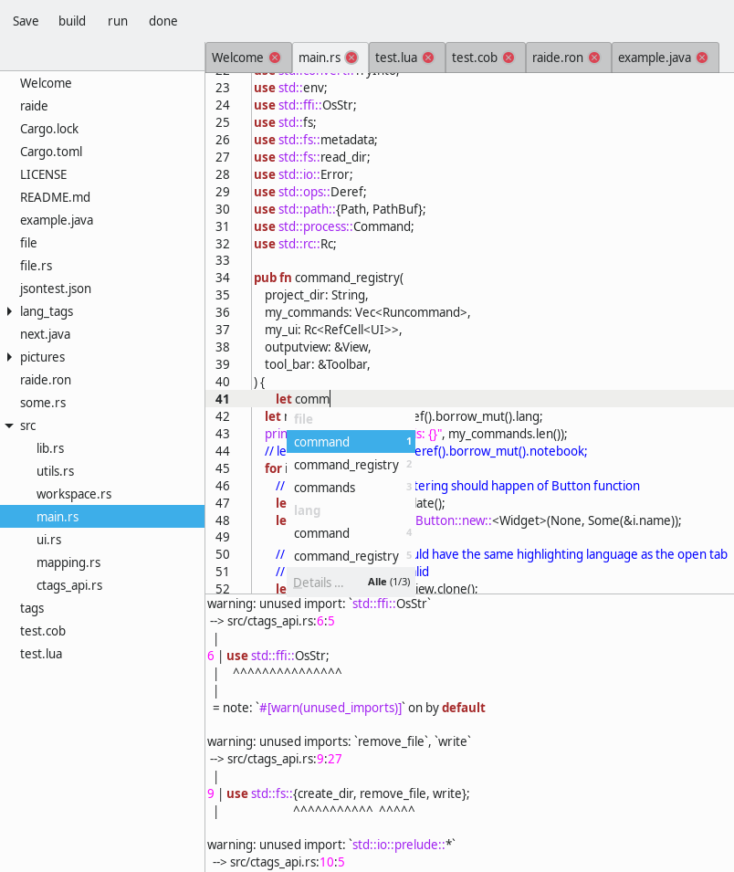

# raide
Raide - A ray of light in the world of IDEs

## Introduction

Raide is a simple IDE with a multi project approach in mind. It features currently:

* A save button
* Multiple Tabs of files that are closable and writable. Right click reveals the full path.
* Source highlighting of many languages including Rust, Java, JSON and Markdown.

## Intended features

As IDEs grow big with many Menu Items, working with them gets confusing. Sadly, many IDEs are only suited to a subset of languages.
By utilizing the underlying command line commands in a configurable workspace.ron, the user can define Buttons and commands with functions that are project dependent.

Another useful feature is code completion, which is file and project dependent.

